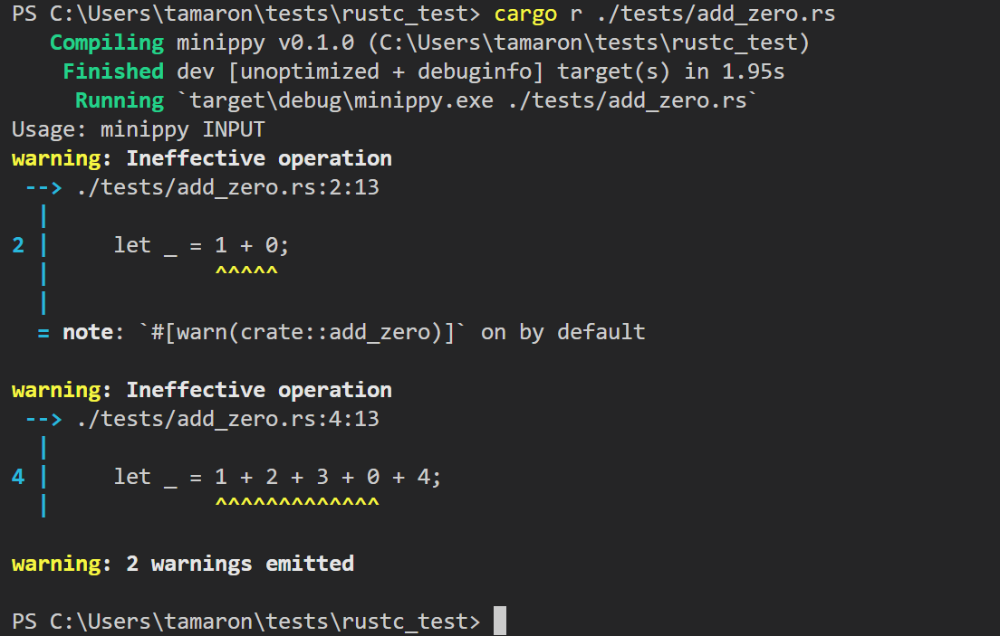

# Minippy
A tiny toy linter influenced by Clippy

## Prerequisites
- Cargo
- rustc private crates

## Usage
```
$ cargo run tests/add_zero.rs
```

## setup
```
$ rustup override set nightly
$ rustup component add rust-src rustc-dev llvm-tools-preview
```

## Screenshots

